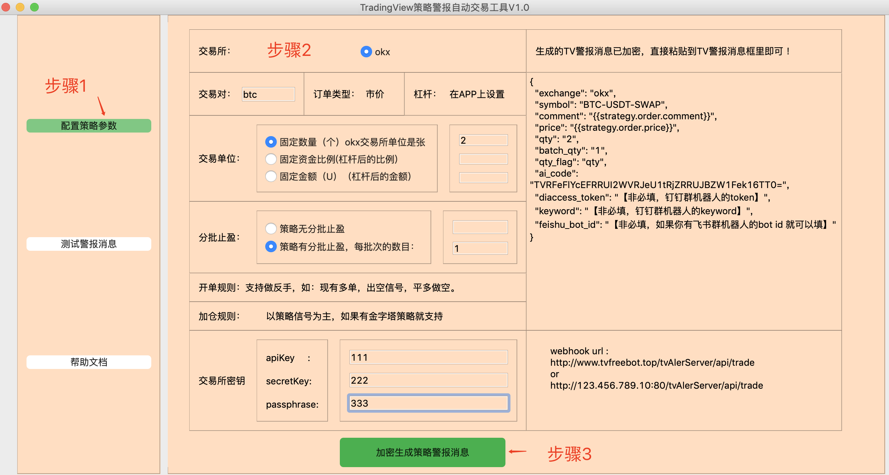
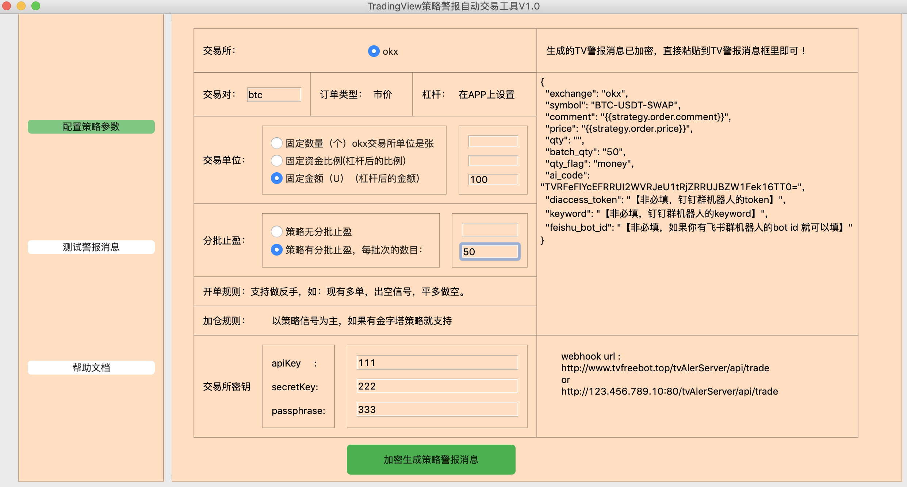
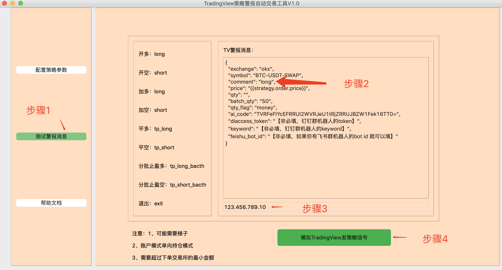
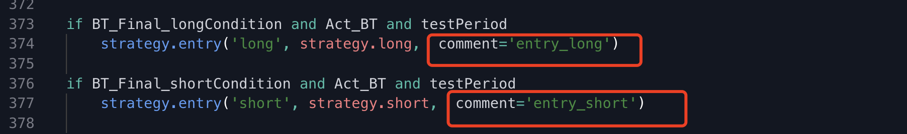
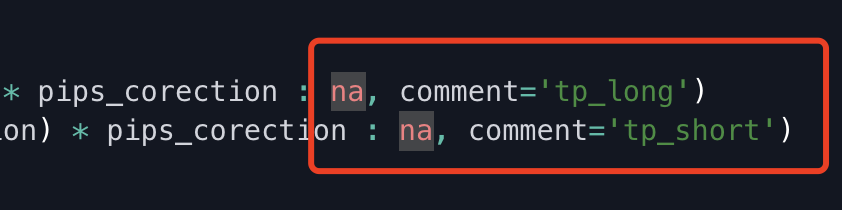
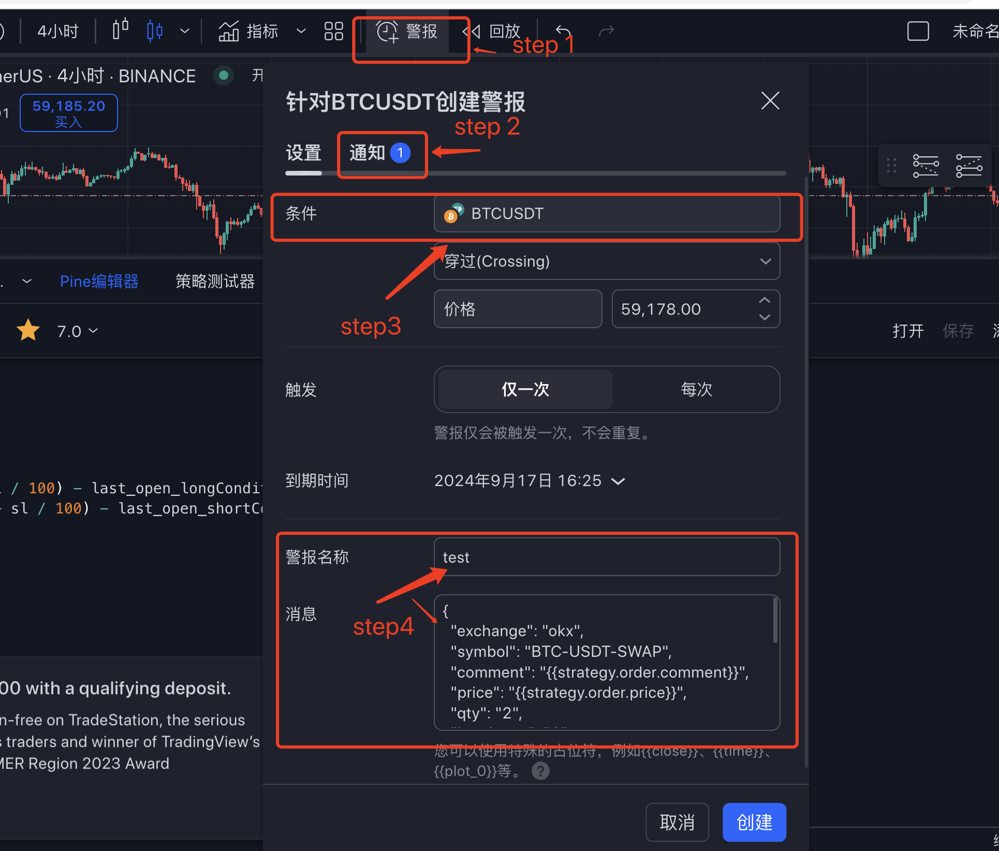

### 						TradingView策略信号接收工具

### 0、介绍

​	最近基于PyQT5的C-S架构开发里一个TradingView策略信号接收工具，目前在okx交易所可以做到自动交易，免费开源给粉丝朋友们，进群可享受一周的公有云测试，群中也附带一些pine 语言写的策略（电报群获取）可以仅供学习参考，不作为投资建议！！！欢迎star。

​	主要功能：

​	1）tv信号自动化交易

​    2）支持固定金额、固定数目、账户剩余金额比例进行下单交易

​    3）支持分批平仓（相当于减仓）下单

​	4）支持加仓下单

​    5）支持正向信号的反向仓位全平下单

​	6）支持alert_message方式的信号进行下单交易

​    7)  支持tv信号模拟下单

##### 	等具体的请看YouTube视频。

​	使用工具需要3个条件：第一个是要有TV会员账号；第二个是要有非大陆的服务器或者电脑；第三个就是你要有TradingView策略。

### 1、安装部署工具步骤

​	以linux 服务器为例

​		1)、购买境外服务器（至少2核1g，系统centos7以上即可，一年100多块钱）

​		2)、下载安装anaconda（不会登陆linux系统服务器的可以百度一下，或者进群咨询😄）

```python
wget https://mirrors.tuna.tsinghua.edu.cn/anaconda/archive/Anaconda3-2021.05-Linux-x86_64.sh
```

​		安装anaconda参考链接：https://blog.csdn.net/Lin1169404361/article/details/123288482

​		3)、安装工具。

```python
cd tvAlertServer_Okx #进项目文件夹
pip install -r requirement.txt #安装依赖包
```

### 2、交易所设置

​	1）okx交易所交易设置：买卖模式

​	2）以“张”为单位下单，没有小数点的事情。

​	3）杠杆需要在okx app上设置好即可。

### 3、启动服务并测试

1）启动服务步骤：

```python
source source_run.sh start  #启动服务
source source_run.sh status  #查看启动状态，出现pid进程编号基本上启动成功啦
source source_run.sh stop  #停止服务
```

2）测试

​	在tools文件下，根据自己电脑系统选择客户端。

- ​	打开客户端

```python
 windows版本需要解压后，执行后缀为exe的文件即可。
  macos 版本直接双击即可。或者打开终端，把runBot_macos拖进去 enter一下。如果还是不行，可能mac自动把它识别成了文件，需要一次转化，转化步骤：
  打开终端,输入命令：chmod +x 空格 然后 把runBot_macos拖进去 enter一下就可以了，之后就直接可以双击打开了。
```

- ​	创建模拟tv的信号

  ##### 点击步骤1，填写步骤2信息，点击步骤3。最终生成tv警报信息。

  比如：固定下2张btc做多，策略分批止盈1张

  

  比如：固定下100u,策略分批止盈50u 

  

  等具体情况可以查看测试下单视频。

- ​    测试信号

  ##### 点击步骤1，步骤2:粘贴复制tv警报信号，修改你comment的信号值（看左侧取值范围示例），步骤3，填写你的服务器外网ip地址，步骤4点击模拟信号按钮即可。如果出现交易成功，账户也下单了，说明已经成功，可以在tradingview上设置警报信息了，信息就是 >>>创建模拟tv的信号<<< 步骤中生成的。

  

### 4、Pine语言开发的tv策略适配

不是所有的策略拿来就可以直接跑的，需要添加comment来进行适配。首先你要看你的策略里的输入场的信号里有没有comment，如果没有可以这样添加即可：

入场：



出场：



部分出场：

```json
comment = "tp_long_batch"  //多单平部分仓位
comment = "tp_short_batch"  //空单平部分仓位
```

针对不同的情况，这个系统支持的comment的取值范围：

```python
#做多 的comment 取值范围
longComment = ["buy","long","entry_long","entry_buy","B","b","BUY","LONG"]
#做空 的comment 取值范围
shortComment = ["sell","short","entry_short","entry_sell","S","s","SELL","SHORT"]
#平多 的comment 取值范围
tpLongComment =  ["tp_buy","tp_long","TP_BUY","TP_LONG","TP-BUY","TP-LONG","close_buy","close_long","CLOSE_BUY","exit_buy","exit_long","EXIT_BUY"]
#平空 的comment 取值范围
tpShortComment = ["tp_sell","tp_short","TP_SELL","TP_SHORT","TP-SELL","TP-SHORT","close_sell","close_short","CLOSE_SELL","exit_sell","exit_short","EXIT_SELL"]
#如果分批平仓（目前支持指定分批数量平仓）
#后缀要有_batch，比如你现在是多仓10张，我想分批平仓先平5张，那么，comment = "tp_long_batch",以此类推。
```

如果有疑问，欢迎进群交流咨询。

### 5、在trading view上添加策略警报，进行策略实盘

##### 点击警报，然后点击通知，然后填写webhook url ，根据刚才生成的url 填写（注意ip需要是你的服务器ip）,然后选择step3中的策略名称，到期时间往后拉到最长就行，然后给警报随便设置一个名字，把刚才生成的tv警报消息复制进去即可。点击创建，完成策略警报设置。



### 6、免责声明

​		本工具不保证策略收益，一切盈亏损失自行承担！禁止商用，仅供学习使用！如果违反，出了一切法律后果自负。

### 7、学习与交流

​	Telegram群：https://t.me/+bRIWTkW0RjAzYjc9

​	YouTube：https://www.youtube.com/watch?v=Sk1p_h_HKZA&t=3s

​	欧意交易所注册邀请：http://psymxwcpixnt.com/join/2157021699 邀请码：2157021699

​	多人多端稳定收费vpn邀请链接：http://yunti.run/S9cx83

​	币圈二哥量化的口号是：免费开源、暴富向前！！！	


